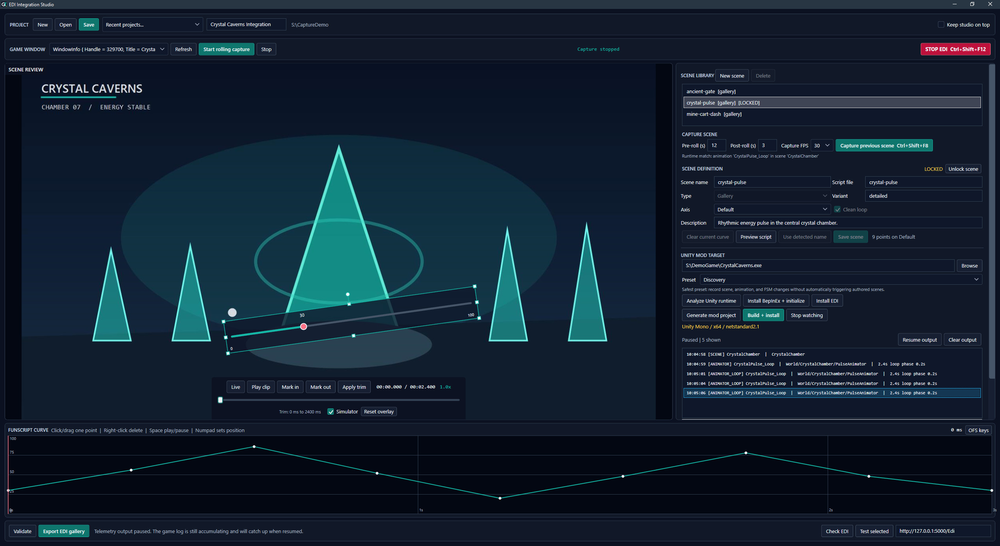

# EDI Integration Studio

EDI Integration Studio is a Windows authoring tool for building game integrations for [Easy Device Integration (EDI)](https://github.com/NoGRo/Edi). It keeps a rolling capture of a visible game window, lets an author isolate and script scenes immediately, exports a validated EDI Gallery, and can generate and install Unity/BepInEx integration plugins without requiring game-specific code for convention-based or explicitly mapped animations.

The repository is named `GTracker`; the application is branded **EDI Integration Studio**. The project is under active development and currently targets Windows x64.



_Authoring workspace shown with a synthetic demo project and capture._

<a href='https://ko-fi.com/Y1C323MGD6' target='_blank'></a>

## Capabilities

- Captures visible windowed or borderless game output through DXGI Desktop Duplication.
- Maintains a memory-bounded JPEG pre-roll and captures configurable pre-roll/post-roll scenes.
- Reviews, loops, scrubs, trims, and manually scripts all EDI axes on a 0-100 timeline.
- Stores project metadata in `project.edi.json` and review frames in ZIP-packaged `.ediclip` assets.
- Validates scene names, file stems, durations, axes, points, loops, variants, bundles, and export collisions.
- Exports EDI `Definitions.csv`, Funscript 1.0 files, separate axis files, optional bundles, and an automatic filler script.
- Detects Unity Mono or IL2CPP, target framework, BepInEx flavor, optional animation frameworks, and build readiness.
- Provisions packaged BepInEx 6 x64 builds, generates a mod scaffold, builds it, and installs the owned plugin.
- Observes Unity scenes, Animator, Legacy Animation, Timeline, PlayMaker, and Mono Spine where runtime support is available.
- Correlates capture intervals with telemetry and creates explicit candidate/path/duration mappings.

## Requirements

### Running The Studio

- Windows 10 or later, x64.
- .NET 8 Desktop Runtime unless using a future self-contained release.
- A DXGI-compatible graphics adapter and a visible, non-minimized game window.
- EDI for testing Gallery playback.

Exclusive fullscreen, HDR/10-bit output, protected content, rotated displays, and monitor changes are not supported by the current capture path. Desktop Duplication records composed screen pixels, so overlapping windows and notifications can appear in saved clips.

### Building From Source

- .NET 8 SDK.
- A matching SDK/targeting pack when building generated plugins for older Unity framework targets.

```powershell
dotnet restore GTracker.slnx
dotnet build GTracker.slnx --configuration Release
dotnet test GTracker.slnx --configuration Release
dotnet run --project src\GTracker.App\GTracker.App.csproj --configuration Release
```

## Preferred Workflow: Timed Unity Games

For well-supported games that emit timed Animator/Mecanim, Legacy Animation, Timeline, or Mono Spine events, **Capture cycle** is the dominant workflow. It is faster and more precise than manually trimming every scene.

1. Click **New**, select the game executable, and click **Analyze Unity runtime**.
2. Install/initialize BepInEx if needed, generate the mod project, then click **Build + install**.
3. Start EDI and the game. Select the visible game window, click **Start rolling capture**, and click **Watch discovery**.
4. Navigate to the gallery or in-game scene you want to script and let at least a couple of stable loops play.
5. Select the newest matching timed telemetry event from the current playback while its cycle is still in the rolling buffer, then click **Capture cycle**.
6. The Studio snapshots the calculated runtime cycle, names the scene when possible, sets loop behavior, and prepares an explicit candidate/path/duration mapping. Check the first and last review frames; manual trim is normally unnecessary.
7. Click **Pause output** after capturing the event to freeze the telemetry UI while the file continues accumulating, then author the funscript curve.
8. Click **Save + lock**. This saves the scene and commits the prepared runtime mapping.
9. Click **Resume output**, move to the next scene, and repeat.
10. After authoring, close the game and rebuild/install to compile the saved mappings into the plugin, then validate and export the EDI Gallery.

### Manual Capture Fallback

If a game does not expose usable timed events, use `Ctrl+Shift+F8` pre/post-roll capture, then mark in/out and apply trim manually. If capture is not running, the first shortcut press selects the foreground window and starts capture; press it again after the target scene.

Confirm the scene name, file stem, type, loop behavior, and tracks before using **Save scene** or **Save + lock**.

`Save` and `Ctrl+S` save project-level settings only. Use **Save scene** to commit the current clip and curves. The application currently has no unsaved-change prompt when switching projects or exiting.

### Export Layout

The selected collection folder name becomes the variant for every scene in that export. Definitions and export ownership data live in the parent `Gallery`; scripts live in the selected child:

```text
Gallery/
|-- .edi-integration-studio-export.json
|-- Definitions.csv
`-- detailed/
    |-- attack.funscript
    `-- filler.funscript
```

When the project does not already supply or reserve `filler`, export adds this definition and a 1200 ms `0 -> 40 -> 0` filler script to each exported variant:

```csv
filler,filler,0,1200,filler,true,
```

The manifest manages files at the entire `Gallery` root. Re-exporting the same project may remove files from its previous collection when they become stale. Do not have different Studio projects manage the same `Gallery` root.

## Unity Setup Details

1. Select the real game executable, choose **Discovery**, and click **Analyze Unity runtime**.
2. If needed, close the game and use **Install BepInEx + initialize**. Automatic provisioning supports x64 games and installs the packaged BepInEx 6 Mono or IL2CPP build.
3. Optionally use **Install EDI** with a standalone, known-compatible folder containing `Edi.exe`. Existing destination `Gallery` contents are preserved.
4. Click **Generate mod project** and choose an empty folder.
5. Close the game and click **Build + install**.
6. Launch EDI and the game, start rolling capture, then click **Watch discovery**.
7. Prefer the timed **Capture cycle** workflow above. Use **Map selected** manually for untimed candidates or an already-authored scene.

`Discovery` applies explicit mappings but does not convention-match unrelated names. Other presets can convention-match normalized scene or animation names. Explicit animation mappings can additionally discriminate by hierarchy path and cycle duration.

Initial scaffold generation refuses to overwrite generated files. Later **Build + install** refreshes `IntegrationMod.csproj`, `RuntimeObserver.cs`, `EdiClient.cs`, `GamePreset.cs`, `ActionNames.cs`, and `scaffold.json`; keep custom Harmony code in `Plugin.cs` or separate source files.

Mono `.NET 3.5` Unity profiles are detected but are not supported by the current generated HTTP client. IL2CPP builds require generated BepInEx interop assemblies.

## Essential Controls

### Studio

| Keys | Action |
| --- | --- |
| `Ctrl+Shift+F8` | Start foreground capture when idle, or capture the previous scene when active |
| `Ctrl+Shift+F12` | Stop EDI playback |
| `Space` | Play or pause the review clip |
| `Ctrl+S` | Save project-level settings |
| `Ctrl+Shift+S` | Export the EDI Gallery |
| `Ctrl+Z` / `Ctrl+Y` | Undo or redo timeline edits |

### Generated Plugin

Top-row and numpad keys work while the game has focus:

| Key | Action |
| --- | --- |
| `1` | Pause EDI playback |
| `2` | Resume EDI playback |
| `3` | Set intensity to 40% |
| `4` | Set intensity to 100% |
| `5` | Activate the `filler` action |

## Framework Support

| Runtime source | Mono | IL2CPP |
| --- | --- | --- |
| Scene changes | Observed | Observed |
| Animator | Observed when references exist | Observed after interop generation |
| Legacy Animation | Observed | Observed after interop generation |
| PlayableDirector/Timeline | Observed when the module exists | Observed when the interop module exists |
| PlayMaker | Conditional observer | Conditional observer |
| Spine `SkeletonAnimation` | Observed with matching Spine assemblies | Detected only |

Other catalogued frameworks may appear as capability evidence without a runtime observer. Discovery cannot infer arbitrary game semantics from unknown names, procedural transforms, custom native animation, stripped methods, or obfuscated code.

## Data And Privacy

- `.ediclip` files contain captured screen pixels and may include notifications or overlapping windows.
- Project saves retain up to 25 prior JSON files under `.history`; this is metadata history, not complete clip versioning.
- Recent project paths are stored in `%LOCALAPPDATA%\EdiIntegrationStudio\recent-projects.json`.
- Unity discovery telemetry is appended under the game's `BepInEx\config`. **Clear output** clears the UI only, not the telemetry file.
- Generated scaffolds and ownership manifests contain local game/project paths, action names, plugin IDs, and timestamps.
- EDI requests default to `http://127.0.0.1:5000/Edi`. A non-loopback URL sends action names and control commands to that endpoint.
- The EDI URL is embedded in `Plugin.cs` during initial scaffold generation and is not persisted in the Studio project or updated by later builds.

Do not publish project directories, `.ediclip` files, telemetry, `scaffold.json`, installation ownership manifests, PDBs, or entire game/BepInEx directories without reviewing them first.

## Known Limitations

- Review clips are JPEG sequences without audio, not standard video files.
- The Studio does not infer per-scene motion curves automatically; authors draw the motion represented by each scene.
- There is no point-selection model, timeline zoom, thumbnail strip, audio track, or visual bundle editor.
- Interactive export uses one selected collection variant at a time.
- Generic telemetry may require explicit mappings or a game-specific patch.
- Automated tests cover core export, persistence, capture, telemetry, generated-source compilation, and deployment behavior, but not every WPF workflow or real game/runtime combination.

## Documentation

- [GitHub Wiki](https://github.com/g95237-del/GTracker/wiki)
- [Installation and prerequisites](https://github.com/g95237-del/GTracker/wiki/Installation-and-Prerequisites)
- [Authoring scenes](https://github.com/g95237-del/GTracker/wiki/Authoring-Scenes)
- [EDI Gallery export](https://github.com/g95237-del/GTracker/wiki/EDI-Gallery-Export)
- [Unity mod workflow](https://github.com/g95237-del/GTracker/wiki/Unity-Mod-Workflow)
- [Runtime discovery and mapping](https://github.com/g95237-del/GTracker/wiki/Runtime-Discovery-and-Mapping)
- [Troubleshooting](https://github.com/g95237-del/GTracker/wiki/Troubleshooting)
- [`docs/EDI_RESEARCH.md`](docs/EDI_RESEARCH.md)
- [`docs/UNITY_FRAMEWORK_RESEARCH.md`](docs/UNITY_FRAMEWORK_RESEARCH.md)

The repository does not yet declare a project-wide software license. The packaged BepInEx distributions retain their separate license notice under `src/GTracker.App/RuntimePackages`.
